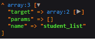

# Feedback1

## 🔥Tout d'abord, Bien joué !🔥

C'est globalement du très bon travail que tu as fait sur ce Challenge. La plupart de ton code fonctionne bien et tu t'es juste bloqué à cause d'un petit détail sur tes formulaires d'Update mais rien de bien grave !

Ce qu'il te manque c'est le match entre:

-   **Ton URL courante** au moment de la soumission des formulaires d'update. Donc au niveau de l'attribut action de tes form (_teacher_update.tpl.php_ ou _student_update.tpl.php_)
-   **Et tes routes existantes dans index.php:** /student/[i:studentid] ou /teacher/[i:studentid]

Ce match, c'est ce qui va permettre au Dispatcher d'appeler la bonne méthode du bon Controller pour exécuter le code que tu souhaites ! Dans le cas du Teacher, il s'agit de la méthode _teacherUpdatePost_ de ton TeacherController.php comme indiqué dans ton index.php.

❗ **Attention, un _$router->generate('nom_de_route')_ ne suffit pas à générer la route complète** si celle-ci attend un paramètre dynamique comme, par exemple, l'ID du Teacher que tu veux éditer. <u>il faut le lui donner !</u>

## ✔ **C'est dommage car tu avais le truc !**

Tu peux faire comme dans ta View _teacher_list.tpl.php (l.22)_ où tu génères bien la bonne route avec le paramètre **teacherId** justement !

N'hésites pas à:

-   📖 **Parcourir les commentaires de l'index.php** de la correction afin de bien comprendre comment cela fonctionne avec $router, $match et le Dispatcher
-   🕵️‍♂️ **Si tu n'avais pas trouvé d'où venait ton problème**, je t'ai mis un guide de comment tu aurais pu t'y prendre pour le repérer toi-même juste en dessous
-   ☎ **Si ce n'est toujours pas clair**, on peut se faire un call et revoir ça ensemble !

* * *
# Le Guide

## 🕵️‍♂️**1) Repérer le problème**

**1) Lorsqu'on soumet le formulaire update Teacher, on a une erreur 404.** Cela veut dire qu'aucune route correspondante n'a été trouvée et l'erreur suivante le confirme puisque le _CoreController.php_ ne récupère pas de $match (ou juste un bool false):

```php
Trying to access array offset on value of type bool in app\Controllers\CoreController.php on line 12
```

On peut en avoir le cœur net avec un dd() dans ton CoreController.php:

```php
global $match;
dd($match);
```

Output:

| Mauvaise URL: /teacher/                 | Bonne URL: /students/list                                                    |
| --------------------------------------- | ---------------------------------------------------------------------------- |
|  |  |

**2) Si on regarde l'url affichée dans la barre d'adresse à ce moment là,** on voit: **/teacher/**

En allant dans _index.php_, il n'y aucune route /teacher/ seule, il est donc normal d'avoir cette erreur.

**3) Ce qu'on veut, c'est matcher la route** "**teacher_update_post**" et donc avoir l'url correspondant à **/teacher/[i:teacherid]&#x3A;**

```php
$router->map(
    'POST',
    '/teacher/[i:teacherid]',
    [
        'method' => 'teacherUpdatePost',
        'controller' => TeacherController::class
    ],
    'teacher_update_post'
);
```

**4) Si on regarde de plus près l'URL générée pour l'attribut action du form** dans _teacher_update.tpl.php,_ cela génère bien que **/teacher/** seul:

```php
<?= $router->generate('teacher_update_post') ?> // output: /teacher/
```

### **🐞 Le problème vient de là ! Il manque le paramètre id dans l'url envoyée par le formulaire update.**


## ✔ **2) Corriger le problème**

**Ajouter le paramètre teacherid** pour matcher '**teacher_update_get'**:

```php
<?= $router->generate('teacher_update_get', [ "teacherid" => $teacher->getId() ]) ?>
```

**🔎 A noter que tu n'es pas obligé de remplir l'attribut action de tes form** surtout si tes routes sont bien configurées et nommées. Par défaut, l'action s'adapte à l'url en cours. Les 2 codes suivant fonctionnent:

```php
<form action="<?=$router->generate('teacher_update_post', [ "teacherid" => $teacher->getId() ])?>" method="POST">
```

ou

```php
<form method="POST">
```

