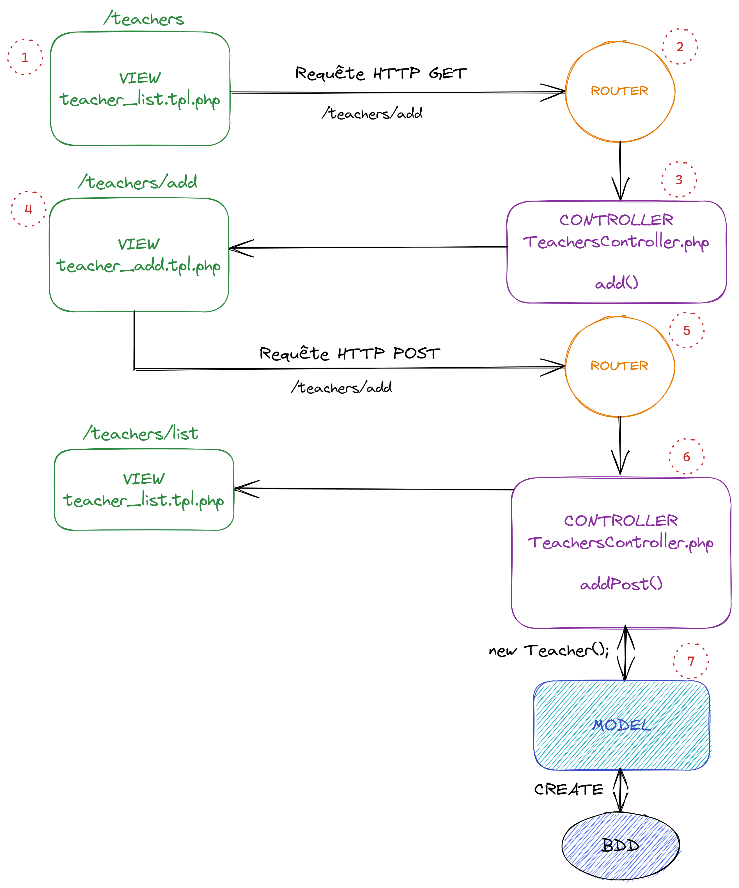

# Feedback2

## 🖌 On s'emmêle les pinceaux !

J'ai l'impression que tu ne sais plus trop où en donner de la tête entre les notions:

-   D'ajout/modification d'Entités (ex: Professeur ou Etudiant)
-   Les Routes et requêtes HTTP (GET/POST)
-   Le rôle du Controller dans tout ça !?

**Pas de panique !** C'est courant, il y a beaucoup de choses à comprendre et toutes ces notions communiquent entre elles pour donner le résultat final donc c'est important de remettre un peu tout à plat ensemble.

### 🎭 Scénario: Ajout d'une nouvelle Entité

Voilà ce qu'il doit se passer à l'ajout d'une Entité Professeur:

1.  **[VIEW]** L'utilisateur clique sur un bouton "Ajouter" qui lance une requête HTTP GET avec l'url "/teachers/add"
2.  **[ROUTER]** Le Router va matcher la route correspondante et appeler la bonne méthode du bon Controller: add() dans TeachersController.php
3.  **[CONTROLLER]** TeachersController retourne la view teachers/teachers_add qui correspond à teachers_add.tpl.php contenant un formulaire d'ajout vide
4.  **[VIEW]** L'utilisateur rempli le formulaire puis clique sur le bouton pour le soumettre ce qui envoi une requête HTTP en méthode POST cette fois-ci mais toujours avec l'url "/teachers/add"
5.  **[ROUTER]** Le Router va matcher la route correspondante et appeler la bonne méthode du bon Controller. Ca pourrait être une nouvelle function "addPost()" dans TeachersController.php
6.  **[CONTROLLER]** TeachersController va récupérer et vérifier les données du formulaire, créer l'Entité (MODEL) correspondante avant de rediriger vers une VIEW au choix, ici la liste de professeur.
7.  **[MODEL]** Une nouvelle entité Teacher a bien été créée via TeachersController. Cela correspond à une nouvelle entrée dans la Base de données.

A l'aide de la correction, essaies de reproduire le parcours qu'on vient de voir et de faire l'ajout d'un professeur.

☎**Une fois que c'est fait ou si tu bloques trop longtemps,** on fera un call pour reprendre tout ça et éventuellement faire l'update d'un Professeur ensemble.

* * *

## 🤷‍♂️Mais Par où commencer ?

Tu as un peu mal à la tête avec tout ça et ne sais pas trop par où attaquer ? Pas de soucis, essaies déjà de commencer par:

-   **Ajouter le bouton "Ajouter" à ta View teachers_list** qui redirige vers /teachers/add en GET. Un simple href peut suffire, par défaut les requêtes HTTP sont en GET. Cela correspond au 1) du schéma précédent que tu avais déjà fait mais sur le bouton d'édition donc ne mélangeons pas tout ! A noter que tu as déjà les étapes 2), 3) et 4) d'implémentées, c'est déjà pas mal !
-   **Ajouter au $router la route correspondant à ta méthode POST** (soumission du formulaire). Ca correspond au numéro 5) du schéma.
-   **Implémenter la function addPost()** de ton TeachersController. Etape 6) du schéma.
-   **Implémenter la function insert() de ton Model** Teacher.php. Etape 7) du schéma.

